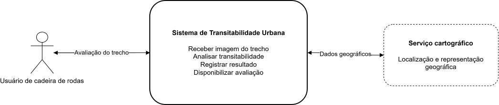
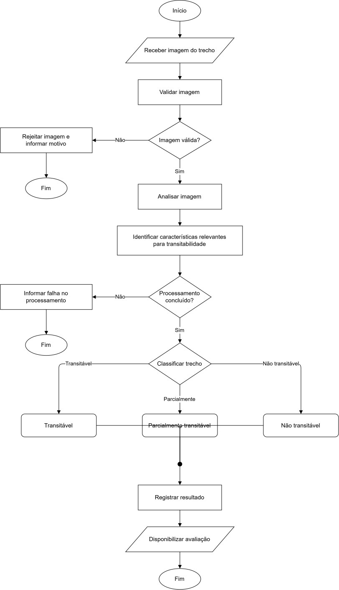

# Modelagem do MVP

## Canvas de modelagem da solução

### 1. Fronteira

**Atores e sistemas externos**

- Usuário de cadeira de rodas.
- Serviço cartográfico.

**Pertence ao MVP**

- Receber imagem de um trecho urbano.
- Identificar características relevantes para a transitabilidade.
- Classificar o trecho como transitável, parcialmente transitável ou não transitável.
- Registrar e disponibilizar o resultado da análise.



### 2. Fluxo



**Exceções**

- Imagem inválida: a imagem é rejeitada e o motivo é informado.
- Falha no processamento: a análise é interrompida e nenhuma classificação é registrada.

### 3. Funções

| Funcionalidade                                                                     | Prioridade  |
| ---------------------------------------------------------------------------------- | ----------- |
| Receber imagem de um trecho urbano                                                 | Must have   |
| Identificar características relevantes para transitabilidade                       | Must have   |
| Classificar o trecho como transitável, parcialmente transitável ou não transitável | Must have   |
| Registrar o resultado da análise                                                   | Must have   |
| Associar a análise a uma localização geográfica                                    | Should have |
| Exibir trechos analisados em mapa                                                  | Should have |

### 4. Dados

| Dado / entidade               | Origem                                            | Destino / uso                     | Informação sensível                                              |
| ----------------------------- | ------------------------------------------------- | --------------------------------- | ---------------------------------------------------------------- |
| Imagem do trecho              | Usuário                                           | Processamento da análise          | Pode conter pessoas, veículos ou outros elementos identificáveis |
| Características identificadas | Processamento da imagem                           | Classificação do trecho           | Não                                                              |
| Classificação do trecho       | Sistema                                           | Registro e consulta               | Não                                                              |
| Localização geográfica        | Serviço cartográfico / dados associados ao trecho | Representação em mapa             | Não, desde que represente apenas a localização do trecho urbano  |
| Data da análise               | Sistema                                           | Histórico e atualização do trecho | Não                                                              |
| Versão do modelo              | Sistema                                           | Rastreabilidade da análise        | Não                                                              |

### 5. Evidência

A saída principal do MVP é a classificação de um trecho em uma das três categorias:

- Transitável
- Parcialmente transitável
- Não transitável

A validação será realizada em um conjunto de imagens previamente rotuladas, comparando a classificação produzida pelo sistema com o gabarito esperado.

**Métricas previstas:**

- Acurácia
- Precisão
- Recall
- F1-score por classe

**Critério de aceitação funcional:**

- Dada uma imagem válida, o sistema deve retornar exatamente uma das três classes definidas e registrar o resultado juntamente com as características identificadas.

## Blueprint Integrado do Protótipo

### 1. Modelo

#### Contexto

- **Ator principal:** usuário de cadeira de rodas.
- **Sistema:** Sistema de Transitabilidade Urbana.
- **Sistema externo:** serviço cartográfico.
- **Perfil considerado no MVP:** usuário de cadeira de rodas.

#### Fluxo principal

`Imagem → Validação → Análise visual → Características → Classificação → Registro → Resultado`

1. Receber uma imagem de um trecho urbano.
2. Validar a imagem.
3. Analisar visualmente o trecho.
4. Identificar características relevantes para a transitabilidade.
5. Classificar o trecho em uma das três classes definidas.
6. Registrar a análise.
7. Disponibilizar o resultado.

#### Classes de transitabilidade

- Transitável.
- Parcialmente transitável.
- Não transitável.

#### Exceções

- **Imagem inválida:** a imagem é rejeitada e o motivo é informado.
- **Falha no processamento:** a análise é interrompida e nenhuma classificação é registrada.

#### Estados essenciais

| Estado           | Descrição                                 |
| ---------------- | ----------------------------------------- |
| Recebida         | Imagem recebida pelo sistema              |
| Em processamento | Análise da imagem em execução             |
| Concluída        | Análise finalizada e resultado registrado |
| Rejeitada        | Imagem considerada inválida               |
| Erro             | Processamento interrompido por falha      |

#### Transições

```text
Recebida → Em processamento → Concluída
Recebida → Rejeitada
Em processamento → Erro
```

### 2. Estrutura

| Componente                        | Responsabilidade                                             | Entrada               | Saída                             |
| --------------------------------- | ------------------------------------------------------------ | --------------------- | --------------------------------- |
| Interface                         | Receber a imagem e apresentar a avaliação                    | Imagem do trecho      | Resultado da análise              |
| Serviço de aplicação              | Validar a entrada e coordenar o processamento                | Imagem recebida       | Resultado consolidado             |
| Analisador visual                 | Identificar características relevantes do trecho             | Imagem válida         | Características identificadas     |
| Classificador de transitabilidade | Avaliar as características para o perfil de cadeira de rodas | Características       | Classe, confiança e justificativa |
| Persistência                      | Armazenar os dados produzidos pela análise                   | Resultado consolidado | Registro da análise               |

#### Contratos principais

**Interface → Serviço de aplicação**

Entrada:

- imagem.

Saída:

- identificador da análise;
- status;
- resultado, quando disponível.

**Serviço de aplicação → Analisador visual**

Entrada:

- imagem válida.

Saída:

- características identificadas;
- confiança de cada identificação.

**Serviço de aplicação → Classificador**

Entrada:

- características identificadas.

Saída:

- classe;
- confiança;
- justificativa.

**Serviço de aplicação → Persistência**

Entrada:

- dados da análise;
- características;
- classificação;
- versão do modelo.

Saída:

- registro persistido.

### 3. Dados

#### Trecho

| Campo     | Finalidade              |
| --------- | ----------------------- |
| id        | Identificação do trecho |
| latitude  | Localização geográfica  |
| longitude | Localização geográfica  |

#### Análise

| Campo         | Finalidade                                 |
| ------------- | ------------------------------------------ |
| id            | Identificação da análise                   |
| trecho_id     | Associação com o trecho, quando disponível |
| imagem_ref    | Referência da imagem analisada             |
| data          | Momento da análise                         |
| status        | Estado da análise                          |
| classe        | Resultado da classificação                 |
| confianca     | Confiança da classificação                 |
| justificativa | Fundamentação da classificação             |
| versao_modelo | Versão do modelo utilizado                 |

#### Característica

| Campo      | Finalidade                          |
| ---------- | ----------------------------------- |
| id         | Identificação da característica     |
| analise_id | Associação com a análise            |
| tipo       | Tipo da característica identificada |
| confianca  | Confiança da identificação          |

#### Origem e persistência

| Dado             | Origem                                            | Persistência                    |
| ---------------- | ------------------------------------------------- | ------------------------------- |
| Imagem           | Usuário ou conjunto controlado de teste           | Arquivo + referência na análise |
| Localização      | Dados associados ao trecho / serviço cartográfico | Trecho                          |
| Características  | Analisador visual                                 | Característica                  |
| Classe           | Classificador                                     | Análise                         |
| Confiança        | Analisador visual / classificador                 | Característica e análise        |
| Justificativa    | Classificador                                     | Análise                         |
| Status           | Sistema                                           | Análise                         |
| Data             | Sistema                                           | Análise                         |
| Versão do modelo | Sistema                                           | Análise                         |

#### Informação sensível

- A imagem pode conter pessoas, placas de veículos ou outros elementos identificáveis.
- A localização armazenada corresponde ao trecho urbano analisado.
- O MVP não exige armazenamento de dados pessoais do usuário.

---

### 4. Fatia vertical

#### Entrada

Imagem real ou controlada de um trecho urbano.

#### Fluxo

```text
Imagem
  ↓
Validação
  ↓
Análise visual
  ↓
Características
  ↓
Classificação
  ↓
Persistência
  ↓
Resultado
```

#### Saída demonstrável

- classe de transitabilidade;
- confiança da classificação;
- características identificadas;
- justificativa;
- status da análise.

#### Escopo da primeira fatia

**Incluído**

- entrada de imagem;
- validação;
- análise visual;
- identificação de características;
- classificação;
- persistência;
- apresentação do resultado.

**Não incluído**

- cálculo de rotas;
- múltiplos perfis de mobilidade;
- cobertura completa da cidade;
- integração completa com mapa.

### 5. Validação

#### Baseline

Classificador majoritário, que retorna sempre a classe mais frequente do conjunto utilizado como referência.

#### Métricas

- Acurácia.
- Precisão por classe.
- Recall por classe.
- F1-score por classe.
- Macro F1.

#### Critérios de aceitação

- Uma imagem válida deve ser processada.
- A análise deve produzir características relevantes para a transitabilidade.
- Cada análise concluída deve possuir exatamente uma das três classes.
- O resultado deve ser registrado.
- A versão do modelo deve ser registrada.
- Uma imagem inválida deve produzir uma resposta controlada.
- Uma falha de processamento não deve gerar uma classificação válida.

#### Roteiro de validação

1. Inicializar o protótipo.
2. Selecionar uma imagem do conjunto de teste.
3. Enviar a imagem.
4. Verificar o processamento.
5. Consultar as características identificadas.
6. Consultar a classificação produzida.
7. Confirmar o registro da análise.
8. Comparar a classe produzida com o gabarito.
9. Repetir o processo para o conjunto de avaliação.
10. Calcular as métricas.
11. Testar uma imagem inválida.
12. Testar uma falha de processamento.

#### Definition of Done

A primeira fatia vertical será considerada concluída quando:

- o fluxo completo entre imagem e resultado estiver executável;
- uma imagem válida chegar até uma classificação;
- as características identificadas forem apresentadas;
- exatamente uma das três classes for retornada;
- o resultado for persistido;
- entradas inválidas forem tratadas;
- falhas de processamento forem tratadas;
- existir um conjunto fixo de teste com gabarito;
- as métricas puderem ser reproduzidas;
- a versão do modelo estiver associada à análise;
- outra pessoa conseguir executar a demonstração sem modificar o código.

### 6. Plano

| Tarefa                                    | Responsável | Dependência                    | Risco                                        | Evidência                                 |
| ----------------------------------------- | ----------- | ------------------------------ | -------------------------------------------- | ----------------------------------------- |
| Definir conjunto inicial de imagens       | Equipe      | Classes definidas              | Imagens pouco representativas                | Conjunto de imagens selecionado           |
| Definir gabarito das imagens              | Equipe      | Conjunto inicial               | Classificação de referência inconsistente    | Arquivo com classe esperada por imagem    |
| Separar dados de treinamento e avaliação  | Equipe      | Dataset disponível             | Vazamento entre conjuntos                    | Divisão documentada                       |
| Implementar entrada e validação de imagem | Equipe      | Formatos aceitos definidos     | Entrada incompatível                         | Imagem válida aceita e inválida rejeitada |
| Implementar análise visual                | Equipe      | Dados e modelo definidos       | Características identificadas incorretamente | Resultado da análise visual               |
| Implementar classificação                 | Equipe      | Características disponíveis    | Erros entre as três classes                  | Classe produzida pelo sistema             |
| Implementar persistência                  | Equipe      | Modelo de dados definido       | Perda de rastreabilidade                     | Registro da análise                       |
| Implementar apresentação do resultado     | Equipe      | Fluxo integrado                | Resultado incompleto                         | Resultado demonstrável                    |
| Implementar tratamento das exceções       | Equipe      | Fluxo principal                | Falhas não controladas                       | Testes de erro                            |
| Executar avaliação                        | Equipe      | Protótipo funcional e gabarito | Baixa generalização                          | Métricas calculadas                       |
| Documentar execução                       | Equipe      | Validação concluída            | Processo não reproduzível                    | Roteiro e resultados registrados          |
